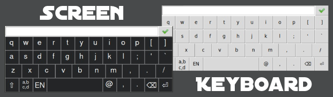
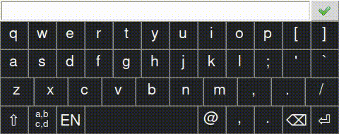
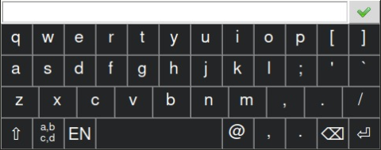
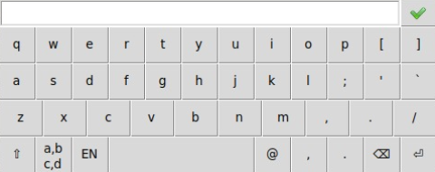

<h1 align="center">ScreenKeyboard</h1>
<h2 align="center">

</h2>

<p align="center">
  


</p>



## Description

<p align="center">
</p>

Экранная клавиатура была разработана для raspberry pi 3 с сенсорным экраном 480х320. 
По-умолчанию, она соответсвует этому размеру и отображается в верхнем левом углу экрана с некоторыми отступами;
Содержит однострочное поле для ввода и два языка: русский и английский, 
а так же цифровую клавиатуру в каждом из них.
Впрочем она полностью настраиваемая:

## Как использовать

### Через импорт
```

from screen_keyboard import run
result = run(settings={})

```

Передайте текущий текст поля при вызове:
```

result = run(settings={
    "text" : "Hello world"
    })

```

Клавиатура закрывается по клику вне ее пределов или кнопкой подтверждения ввода.
Всегда возвращает словарь с введенным текстом *value* и информацией был ли ввод подтвержден или отменен *result*

```

{
"value": app.value,
"result": app.result    //bool
}

```

## Настройка

### Размеры и положение

Размеры и положения по-умолчанию можно изменить/задать в файлах разметки клавиатуры для каждого языка:

```

<ScreenKeyboard width="480" locationX="0" locationY="0" languare="EN">
...
<EntryField height="30">
...
<InputBlock height = "120">
...
<GeneralButtons height = "40">
...

```

Или передать при вызове:

```

string result = run(settings={
    "w"  : 640, 
    "h1" : 40,  // EntryField height
    "h2" : 180, // InputBlock height
    "h3" : 60,  // GeneralButtons height
    "lx" : 100, 
    "ly" : 100
    })

```

### Добавить, удалить, изменить языки:

```

string result = run(settings={
    "languages_path" : os.path.join(os.path.dirname(os.path.realpath(__file__)), "languages"),
    })

```

- Укажите путь к папке с файлами разметки разных языков клавиатуры
- Поместите в эту папку файл(ы) с необходимыми разметками
- Клавиатура автоматически подхватывает все файлы из этой папки и последовательно переключает их

#### Правила разметки 
- Ширина указывается общая.
- Высота указывается для каждого из 3 блоков контролей своя
- в каждом блоке может быть **x** строк высотой **h/x**
- ширина каждого элемента задается через параметр **size** и рассчитывается 
как **width/12*size**, округление до ширины клавиатуры происходит за счет последнего элемента.
- field может быть только 1 - однострочный или многострочный.
- buttons могуты быть нескольких типов: 
  - **apply** - закрывает клавиатуру и возвращает введенный текст. Может быть с иконкой **icon** или подписью **text**. 
  - **input** - ввод сивола **value1** или **value2** в зависимости от того включен ли **shift**
  - **turn** - переключение режимов, имеет параметр **turnTarget**, который может быть *uppercase* или *numbers*
    Может быть с иконкой **iconTurnOn**/**iconTurnOff** или подписью **textTurnOn**/**textTurnOff**. 
  - **languare** - переключает все добавленные языки. Отображает название текущего.
  - **action** - выполняет действие, имеет параметр **action**, который может быть *backspace* или *enter*.
    Может быть с иконкой **icon** или подписью **text**.

В разметке для любой кнопки можно указать **font-size** ("Small", "Normal", "Large") 
и положение **align** ("Top", "Center", "Bottom"). Если не указано: "Normal" + "Center"

### Поле ввода

По-умолчанию задано в файле разметки

```

<field type="line" size="11.0"></field>

```

Можно изменить при вызове

```

string result = run(settings={
    "multiline" : True, 
    })

```

### Размер шрифта

В файле разметки:

```

<Font name="Helvetica" small="10" normal="16" large="20"></Font>

```

При вызове из программы:

```

string result = run(settings={
    "font" : 'Helvetica', 
    "font_size" : {
        "small" : 10,
        "normal" : 12,
        "large" : 14,
        }, 
    })

```


### Путь к файлу с иконками для кнопок

```

"icon_path" : os.path.join(os.path.dirname(os.path.realpath(__file__)), "attachments"),  

```

### Настройка цветов кнопок

Только при вызове из программы:

```

string result = run(settings={
    "b_foreground_!active":"#ffffff", 
    "b_foreground_pressed":"#ffffff",
    "b_foreground_active":"#ffffff",
    "b_background_!active":"#232526",
    "b_background_pressed":"#484a4b",
    "b_background_active":"#484a4b",
    })

```

**Стандартный вид**

<p align="center">
</p>

**С отключенной настройкой цветов**

```

string result = run(settings={
    "b_customize":False, 
    })

```

<p align="center">
</p>


## Из командной строки

Все настройки доступные при импорте, доступны и при вызове через коммандную строку/

```

python3 ScreenKeyboard.py -[option]

```
**-help** - full options list
**-t** - current text
**-w** - width
**-h1** - EntryField height
**-h2** - InputBlock height
**-h3** - GeneralButtons height
**-x** - location x
**-y** - location y
**-c** - b_customize
**-m** - multiline
**-fname** - font family name
**-fsize** - font sizes
**-i** - icon path
**-l** - languages path
**-bfu** - button foreground unactive color
**-bfp** - button foreground pressed color
**-bfa** - button foreground active color
**-bbu** - button background unactive color
**-bbp** - button background pressed color
**-bba** - button background active color

Результаты можно забрать из *environment variables*:

```

"screen_keyboard_value"
"screen_keyboard_result"

```